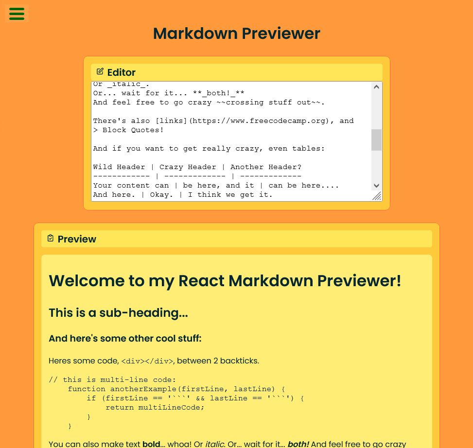

# freeCodeCamp - Front End Development Libraries Projects

This is a solution to the [Build a Markdown Previewer](https://www.freecodecamp.org/learn/front-end-development-libraries/front-end-development-libraries-projects/build-a-markdown-previewer). 

## Table of contents

  - [The challenge](#the-challenge)
  - [Screenshot](#screenshot)
  - [Links](#links)
- [My process](#my-process)
  - [Built with](#built-with)
  - [What I learned](#what-i-learned)
- [Author](#author)
- [Acknowledgments](#acknowledgments)

### The challenge

Build a Random Quote Machine

You can use any mix of HTML, JavaScript, CSS, Bootstrap, SASS, React, Redux, and jQuery to complete this project. You should use a frontend framework (like React for example) because this section is about learning frontend frameworks.

User stories [here.](https://www.freecodecamp.org/learn/front-end-development-libraries/front-end-development-libraries-projects/build-a-markdown-previewer)

### Screenshot

### Links

- Solution URL: [GitHub](https://github.com/ivelinsm/markdown-preview)
- Live Site URL: [Netlify](https://happy-galileo-763c4a.netlify.app/)

## My process

  1. This project was fairly easy if we don't count that last extra test that it doesn't pass. 

### Built with

- Semantic HTML5 markup
- CSS
- Flexbox
- React

### What I learned

This project was easier than the rest (if we don't count that last extra test that it doesn't pass). It was more about becoming more familiar with React and repeat some the main steps in building a React app.

1. I learned a cool way to use SVG icons in React without the use of libraries like React Icons or Bootstrap Icons
    - I just create a functional component add the SVG without the xmlns attribute and (of course) replacing the class attribute with className
    - The cool thing is you can easily pass Props to different icons.

2. Gained more familiarity with HTML's textarea as I have never used that element

## Author

- Github - [ivelinsm](https://github.com/ivelinsm)
- freeCodeCamp - [@ivelinsm](https://www.freecodecamp.org/fcc927d30f9)

## Acknowledgments

I would like to thank the whole freeCodeCamp community for the awesome challenge.